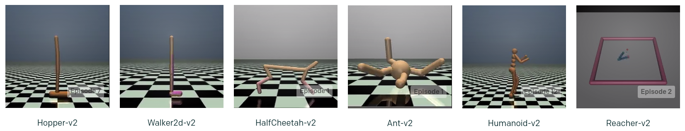

# Real-Time Reinforcement Learning

This repo is accompanying our paper "Real-Time Reinforcement Learning" (https://arxiv.org/abs/1911.04448).

<p align="center">
  
</p>
<p align="center">
  Traditional Reinforcement Learning
  &nbsp;&nbsp;&nbsp;&nbsp;&nbsp;&nbsp;&nbsp;&nbsp;&nbsp;&nbsp;&nbsp;&nbsp;
  Real-Time Reinforcement Learning
</p>


### Getting Started
This repo can be pip-installed via
```bash
pip install git+https://github.com/rmst/rtrl.git
```

To train an RTAC agent on the basic `Pendulum-v1` task run
```bash
python -m rtrl run rtrl:RtacTraining Env.id=Pendulum-v1
```
#### Issues and Fixes (More details in [CHANGES.md](./CHANGES.md))
The main error encountered during this experiment was related to PyTorch's in-place modification/versioning error, triggered by improper handling of tensor operations. It was systematically resolved by explicitly ensuring all observations and actions were properly copied at each step in every environment wrapper (RealTimeWrapper, PreviousActionWrapper, and StatsWrapper). Additionally, careful checks were implemented in the replay buffer (memory.py) and training loop (rtac.py, training.py) to detect and eliminate any unintended in-place operations. These adjustments prevented versioning conflicts in gradient computation, resulting in stable and error-free training.


### Mujoco Experiments
To install Mujoco you follow the instructions at [openai/gym](https://github.com/openai/gym) or have a look at [`our dockerfile`](github.com/rmst/rtrl/blob/master/docker/gym/Dockerfile). The following environments were used in the paper.




To train an RTAC agent on `HalfCheetah-v4` run
```bash
python -m rtrl run rtrl:RtacTraining Env.id=HalfCheetah-v4
```
```bash
python -m rtrl run-fs experiment-2 rtrl:RtacTraining Env.id=HalfCheetah-v4
```

#### Issues and Fixes (More details in [CHANGES.md](./CHANGES.md))
The primary blocker in this experiment was the same PyTorch in-place operation/versioning error, causing interruptions during backpropagation. The issue was addressed similarly by rigorously enforcing deep-copy semantics on all environment-generated tensors (observations and actions) at every wrapper level, and within replay buffers (memory.py). Furthermore, thorough verification was performed on RTAC network model code (rtac_models.py) and loss computations in (rtac.py) to remove inadvertent in-place updates, stabilizing gradient computations. These changes allowed training on the more complex Mujoco environment (HalfCheetah-v4) without errors.

To train a SAC agent on `Ant-v4` with a real-time wrapper (i.e. RTMDP in the paper) run
```bash
python -m rtrl run rtrl:SacTraining Env.id=Ant-v4 Env.real_time=True
```
```bash
python -m rtrl run-fs experiment-3 rtrl:SacTraining Env.id=Ant-v4 Env.real_time=True
```

### Avenue Experiments
Avenue [(Ibrahim et al., 2019)](https://github.com/elementaI/avenue) can be pip-installed via
```bash
pip install git+https://github.com/elementai/avenue.git
```

<p align="center"></p>

<!-- <p align="center"></p> -->

To train an RTAC agent to drive on a race track (right video) run
```bash
python -m rtrl run rtrl:RtacAvenueTraining Env.id=RaceSolo-v0
```
Note that this requires a lot of resources, especially memory (16GB+).


### Storing Stats
`python -m rtrl run` just prints stats to stdout. To save stats use the following instead.
```bash
python -m rtrl run-fs experiment-1 rtrl:RtacTraining Env.id=Pendulum-v1
```
Stats are generated and printed every `round` but only saved to disk every `epoch`. The stats will be saved as pickled pandas dataframes in `experiment-1/stats`.

### Checkpointing
This repo supports checkpointing. Every `epoch` the whole run object (e.g. instances of `rtrl.training:Training`) is pickled to disk and reloaded. This is to ensure reproducibilty.

You can manually load and inspect pickled run instances with the standard `pickle:load` or the more convenient `rtrl:load`. For example, to look at the first transition in a SAC agent's replay memory run
```python
import rtrl
run = rtrl.load('experiment-1/state')
print(run.agent.memory[0])
``` 
